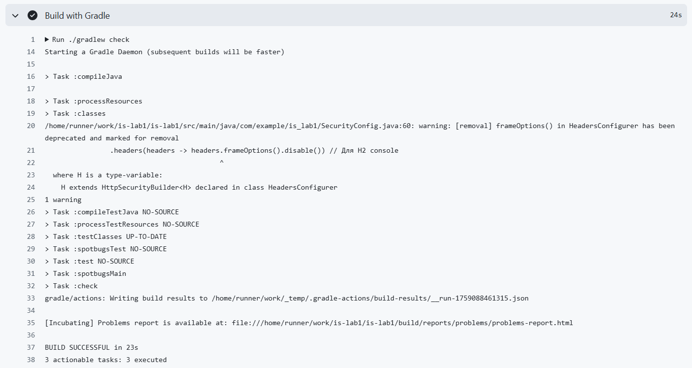

# Secure REST API (Spring Boot)
Защищённое веб-API на Spring Boot с аутентификацией JWT, защитой от распространённых уязвимостей и соответствием best practices безопасности.

## 📌 Описание проекта
Это stateless REST API, реализующее:

Аутентификацию через JWT-токены
Защищённый доступ к данным
Создание постов с санитизацией ввода
Используемые технологии:

Spring Boot 3.2 + Gradle
Spring Security + JWT
Spring Data JPA (с H2 в памяти для демонстрации)
BCrypt для хэширования паролей

## 🌐 Доступные эндпоинты
🔑 Аутентификация
`POST /auth/login`
Аутентифицирует пользователя и возвращает JWT-токен.

Запрос:

```json
{
"username": "admin",
"password": "securePassword123"
}
```

Успешный ответ (200 OK):
```json
{
"token": "eyJhbGciOiJIUzI1NiJ9.xxxxx"
}
```

Ошибки:

401 Unauthorized — неверные учётные данные

## 📊 Защищённые данные
`GET /api/data`
Возвращает список всех постов. Требует JWT-токен.

Заголовок авторизации:
```
Authorization: Bearer <ваш_токен>
```

Ответ (200 OK):

```json
[
{
"id": 1,
"title": "Welcome to Secure API",
"content": "This is a protected post..."
}
]
```

`POST /api/posts`
Создаёт новый пост.

Запрос:
```json
{
"title": "My Post",
"content": "Post content here"
}
```

Ответ (200 OK):

```json
{
"id": 2,
"title": "My Post",
"content": "Post content here"
}
```

## 🛡️ Реализованные меры защиты
1. Защита от SQL-инъекций (SQLi)
   Используется Spring Data JPA (H4) с ORM.
   Даже при вводе ' OR '1'='1 — данные обрабатываются как литерал, а не SQL-код.
   ✅ Результат: SQL-инъекции невозможны.

2. Защита от XSS (Cross-Site Scripting)
   Все пользовательские данные (title, content) санитизируются перед сохранением.
   Реализована HTML-экранировка библиотекой `org.apache.commons:commons-text`

Возвращаемые данные никогда не содержат исполняемого HTML/JS.
✅ Результат: При вводе <script>alert(1)</script> клиент получает &lt;script&gt;alert(1)&lt;/script&gt;.

3. Защита от Broken Authentication
   Пароли хэшируются с помощью BCrypt (адаптивный, с солью).
   Никогда не хранятся в открытом виде — даже в тестовых данных (пароли вынесены в конфигурацию).
   Аутентификация через JWT:
   Токен выдаётся только при успешном логине.
   Срок жизни — 24 часа.
   Подпись — HMAC-SHA256 с секретным ключом.
   Все /api/** эндпоинты защищены middleware, проверяющим JWT.
   Используется stateless-режим (SessionCreationPolicy.STATELESS) → CSRF не применим.
   ✅ Результат: Надёжная аутентификация без утечек учётных данных.

4. Безопасность кода (SAST)
   Устранены предупреждения SpotBugs:
   SECELEAK — JPA-сущности не возвращаются напрямую (используются DTO).
   SECHCP — пароли вынесены из кода в конфигурацию.
   SPRING_CSRF_PROTECTION_DISABLED — отключение CSRF обосновано для JWT API.
   
## SpotBugs (SAST)
SpotBugs Report

✅ 0 уязвимостей — все предупреждения устранены.
